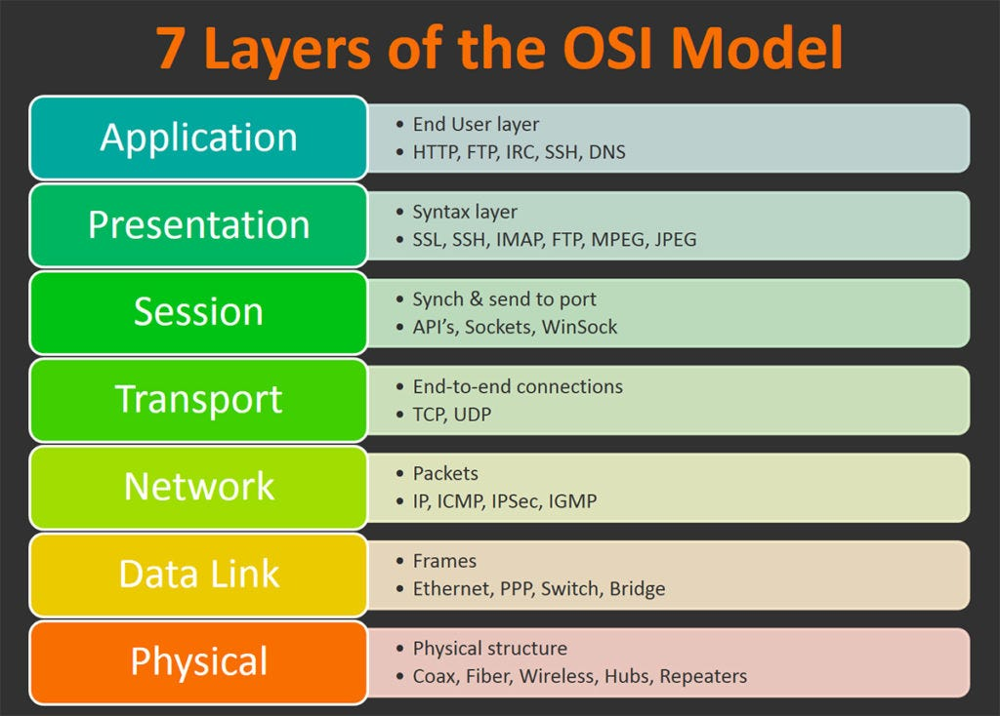

# OSI Model

Before we can look at some practical networking stuff, we have to go over some boring jargon that you've probably heard of before. The OSI (Open Systems Interconnection) model is a theoretical model of networking. This model shows us how a packet traverses through a network in seven different layers. I won't get into specifics of this model, since most of these networking courses will be focused on the TCP/IP model, but it should be mentioned that such a theoretical networking model exists and has actually played a large part in the TCP/IP networking model that we use today.

  

## Exercise

Read more about the OSI model: <a href="https://en.wikipedia.org/wiki/OSI_model">https://en.wikipedia.org/wiki/OSI_model</a>

## Quiz Questions 

Click the right arrow to view the answers

What is used as the theoretical model of networking?

OSI

